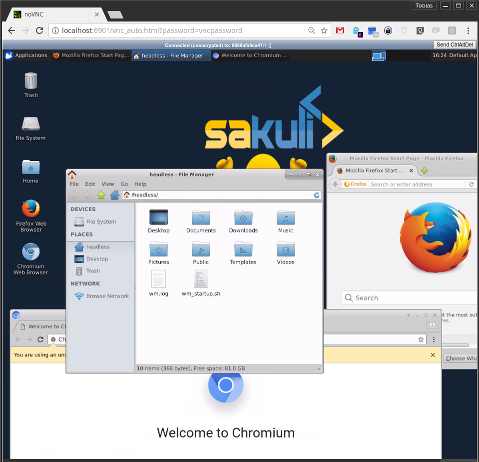

This repository contains a docker image with headless VNC environment.

* Desktop environment [**Xfce4**](http://www.xfce.org) or [**IceWM**](http://www.icewm.org/)
* VNC-Server (default VNC port `5901`)
* [**noVNC**](https://github.com/novnc/noVNC) - HTML5 VNC client (default http port `6901`)
* Browsers:
  * Mozilla Firefox
  * Chromium
  


## Usage
Usage is **similar** for all provided images, e.g. for `consol/centos-xfce-vnc`:

- Print out help page:

      docker run consol/centos-xfce-vnc --help

- Run command with mapping to local port `5901` (vnc protocol) and `6901` (vnc web access):

      docker run -d -p 5901:5901 -p 6901:6901 andresdfx/ubuntu
  
- Change the default user and group within a container to your own with adding `--user $(id -u):$(id -g)`:

      docker run -d -p 5901:5901 -p 6901:6901 --user $(id -u):$(id -g) andresdfx/ubuntu

- If you want to get into the container use interactive mode `-it` and `bash`
      
      docker run -it -p 5901:5901 -p 6901:6901 andresdfx/ubuntu bash

- Build an image from scratch:

      docker build -t andresdfx/ubuntu ubuntu

# Connect & Control
If the container is started like mentioned above, connect via one of these options:

* connect via __VNC viewer `localhost:5901`__, default password: `vncpassword`
* connect via __noVNC HTML5 full client__: [`http://localhost:6901/vnc.html`](http://localhost:6901/vnc.html), default password: `vncpassword` 
* connect via __noVNC HTML5 lite client__: [`http://localhost:6901/?password=vncpassword`](http://localhost:6901/?password=vncpassword) 


## Hints

### 1) Extend a Image with your own software
Since version `1.1.0` all images run as non-root user per default, so if you want to extend the image and install software, you have to switch back to the `root` user:

```bash
## Custom Dockerfile
FROM andresdfx/ubuntu
ENV REFRESHED_AT 2019-07-17

# Switch to root user to install additional software
USER 0

## Install a gedit
RUN yum install -y gedit \
    && yum clean all

## switch back to default user
USER 1000
```

### 2) Change User of running Sakuli Container

Per default, since version `1.3.0` all container processes will be executed with user id `1000`. You can change the user id as follows: 

#### 2.1) Using root (user id `0`)
Add the `--user` flag to your docker run command:

    docker run -it --user 0 -p 6911:6901 andresdfx/ubuntu

#### 2.2) Using user and group id of host system
Add the `--user` flag to your docker run command:

    docker run -it -p 6911:6901 --user $(id -u):$(id -g) andresdfx/ubuntu

### 3) Override VNC environment variables
The following VNC environment variables can be overwritten at the `docker run` phase to customize your desktop environment inside the container:
* `VNC_COL_DEPTH`, default: `24`
* `VNC_RESOLUTION`, default: `1280x1024`
* `VNC_PW`, default: `my-pw`

#### 3.1) Example: Override the VNC password
Simply overwrite the value of the environment variable `VNC_PW`. For example in
the docker run command:

    docker run -it -p 5901:5901 -p 6901:6901 -e VNC_PW=my-pw andresdfx/ubuntu

#### 3.2) Example: Override the VNC resolution
Simply overwrite the value of the environment variable `VNC_RESOLUTION`. For example in
the docker run command:

    docker run -it -p 5901:5901 -p 6901:6901 -e VNC_RESOLUTION=800x600 andresdfx/ubuntu
    
### 4) View only VNC
Since version `1.2.0` it's possible to prevent unwanted control via VNC. Therefore you can set the environment variable `VNC_VIEW_ONLY=true`. If set, the startup script will create a random password for the control connection and use the value of `VNC_PW` for view only connection over the VNC connection.

     docker run -it -p 5901:5901 -p 6901:6901 -e VNC_VIEW_ONLY=true andresdfx/ubuntu

